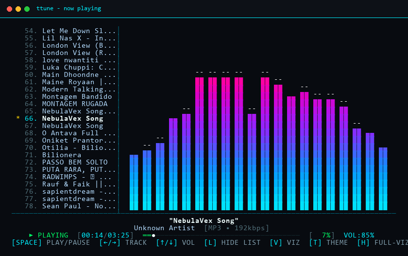
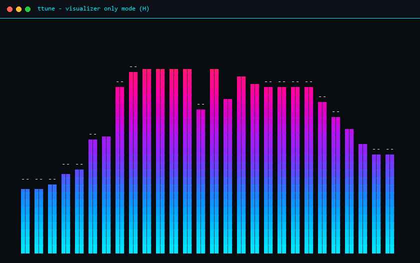
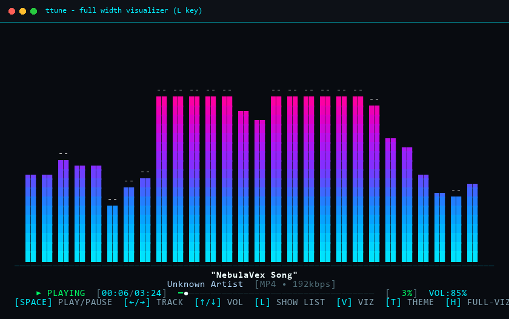
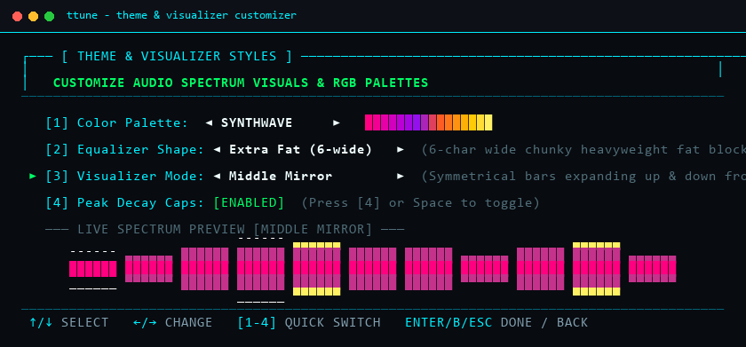
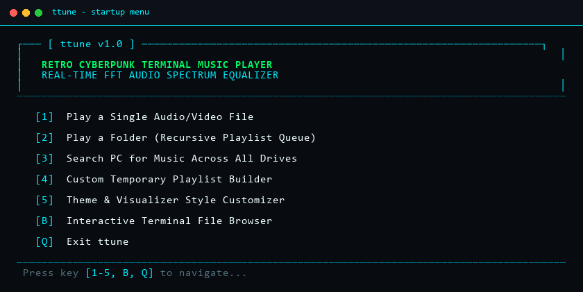

# ttune

A terminal music player with a real-time RGB spectrum visualizer.



---

## Installation

### Prerequisites

- **Python 3.9+**
- **FFmpeg** on system PATH:
  - **Windows**: `winget install Gyan.FFmpeg`
  - **macOS**: `brew install ffmpeg`
  - **Linux**: `sudo apt install ffmpeg`

### Install

```bash
git clone https://github.com/wyzuk/ttune.git
cd ttune
pip install -e .
```

Once installed, the `ttune` command is available directly in your terminal.

---

## Usage

### Interactive Mode
Launch without arguments to open the startup menu and file browser:
```bash
ttune
```

### Play a Single File
```bash
ttune "path/to/song.flac"
```

### Play an Entire Folder
```bash
ttune "path/to/music_folder"
```

### Adjust Starting Volume
```bash
ttune "path/to/music_folder" --volume 70
```

---

## Features

- **Real-Time FFT Spectrum Visualizer**: Hardware-style equalizer bars rendered with truecolor RGB LED blocks with dynamic headroom.
- **Multiple Visualizer Modes (`V` Key)**: Toggle between Bottom-Up, Middle Mirror (center-out dual bloom), Middle Wave, Hanging Top-Down, and Split Mirror.
- **Equalizer Shapes & Sizes**: Standard Brick, Fat Brick (4-wide), Extra Fat (6-wide), Mega Fat (8-wide), Giant (10-wide), Colossal (14-wide), Dense Fat, Matrix Dots, Shaded Blocks, and Braille Waves.
- **Rich Color Gradients (`T` Key)**: 18 high-contrast color palettes (Cyberpunk, Matrix, Synthwave, Fire, Ice, Amber, Vaporwave, Hyperpop, Toxic, Blood Moon, Ocean Abyss, Sunset Blaze, Aurora, Cyber Gold, Cotton Candy, Rainbow, Monochrome, Sakura).
- **Side-by-Side Playlist with Starred Active Track**: Playlist sidebar displayed on the left of the visualizer, highlighting and starring (`*`) the active track.
- **Fullscreen Visualizer Toggle (`L` Key)**: Toggle the playlist sidebar to expand the visualizer to full width.
- **PC-Wide Music Search (`S` in Menu)**: Live search across drives and folders with instant filtering and playback.
- **Temporary Custom Playlist (`P` in Menu / `A` to Add)**: Queue songs on the fly from the file browser or search screen, reorder tracks, and play custom queues.
- **Return to Menu (`B` Key)**: Return from active playback to the startup menu at any time.
- **Visualizer-Only Mode (`H` Key)**: Hide all song information and controls for clean full-screen visuals.
- **Centered Layout & Metadata**: Centered song title, artist/album, bitrate badge, and progress bar below the visualizer.
- **Universal Media Playback**: Supports all common audio formats and decodes the audio track from video files without displaying video.
- **Flicker-Free Screen Buffer**: Double-buffered ANSI rendering at ~35 FPS with low CPU consumption (<3%).

---

## Visualizer & Interface









---

## Keyboard Controls

### Playback Screen
| Key | Action |
|:---|:---|
| <kbd>Space</kbd> | Play / Pause |
| <kbd>←</kbd> | Previous track |
| <kbd>→</kbd> | Next track |
| <kbd>↑</kbd> | Volume up (+5%) |
| <kbd>↓</kbd> | Volume down (-5%) |
| <kbd>L</kbd> | Toggle playlist sidebar (expand visualizer to full screen) |
| <kbd>V</kbd> | Cycle visualizer style (Bottom-Up, Middle Mirror, Wave, Hanging, Split) |
| <kbd>T</kbd> | Open Theme & Style Customizer |
| <kbd>H</kbd> | Toggle visualizer-only mode (hide all metadata & controls) |
| <kbd>B</kbd> | Return to Home Menu |
| <kbd>[</kbd> | Seek backward (-5s) |
| <kbd>]</kbd> | Seek forward (+5s) |
| <kbd>R</kbd> | Cycle repeat mode (`ALL` → `ONE` → `OFF`) |
| <kbd>S</kbd> | Toggle shuffle |
| <kbd>M</kbd> | Toggle mute |
| <kbd>Q</kbd> / <kbd>Esc</kbd> | Quit ttune |

### Navigation & Menus
| Screen | Key | Action |
|:---|:---|:---|
| **Home Menu** | <kbd>1</kbd> / <kbd>F</kbd> | Pick Single File |
| | <kbd>2</kbd> / <kbd>D</kbd> | Pick Folder / Playlist |
| | <kbd>3</kbd> / <kbd>S</kbd> | Search PC for Music |
| | <kbd>4</kbd> / <kbd>P</kbd> | Custom Playlist Builder |
| | <kbd>5</kbd> / <kbd>T</kbd> | Customize Themes & Shapes |
| **File Browser** | <kbd>↑</kbd> / <kbd>↓</kbd> | Navigate files / folders |
| | <kbd>Enter</kbd> | Open folder / Play file |
| | <kbd>A</kbd> | Add highlighted track to Custom Playlist |
| | <kbd>B</kbd> / <kbd>Esc</kbd> | Back |
| **Search Screen**| *Type text* | Live query filtering across PC |
| | <kbd>Enter</kbd> | Play selected track |
| | <kbd>P</kbd> | Play all matching tracks |
| | <kbd>A</kbd> | Add highlighted track to Custom Playlist |
| | <kbd>Esc</kbd> | Return to Menu |
| **Playlist Screen**| <kbd>Enter</kbd> / <kbd>P</kbd>| Start playback of playlist |
| | <kbd>D</kbd> | Remove selected track |
| | <kbd>C</kbd> | Clear playlist |
| | <kbd>U</kbd> / <kbd>J</kbd> | Move track Up / Down |
| | <kbd>B</kbd> / <kbd>Esc</kbd> | Return to Menu |
| **Theme Customizer**| <kbd>←</kbd> / <kbd>→</kbd> | Cycle Color Palettes |
| | <kbd>S</kbd> | Cycle Visualizer Shapes |
| | <kbd>P</kbd> | Toggle Peak Decay Caps |
| | <kbd>Enter</kbd> / <kbd>Esc</kbd> | Apply & Return |

---

## Supported Media Formats

Playback and decoding are handled through FFmpeg / libav:

| Category | Formats |
|:---|:---|
| **Audio** | MP3, WAV, FLAC, AAC, M4A, OGG, OPUS, WMA, AIFF, ALAC, APE, AC3 |
| **Video (Audio Track)** | MP4, MKV, WebM, AVI, MOV, WMV, FLV, M4V, TS |

*Video formats are supported through the media backend and are treated as audio sources.*

---

## Built With

- **Python 3** — Core application architecture and CLI
- **FFmpeg / libav** — Multi-format streaming and raw PCM decoding
- **NumPy** — Fast Fourier Transform (FFT) and frequency band math
- **sounddevice / PortAudio** — Low-latency real-time audio output
- **Mutagen** — Audio tag metadata extraction
- **Windows Console / ANSI Truecolor** — Terminal styling and 24-bit color rendering

---

## License

This project is licensed under the [MIT License](LICENSE).
